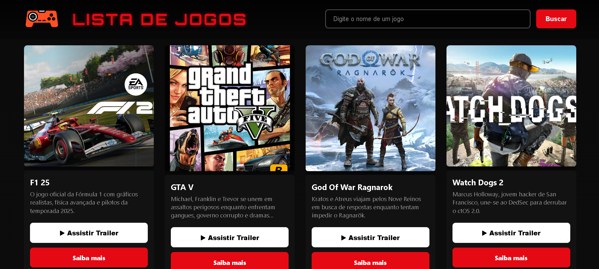

  

<h1>🎮 Lista de Jogos</h1>

<h2>🧩 Sobre o Projeto</h2>

O <strong>Lista de Jogos</strong> é um site criado para exibir jogos de forma moderna, organizada e fácil de navegar.  
Ele mostra cards com imagem, nome, descrição, trailer e detalhes adicionais — tudo carregado automaticamente através de um arquivo JSON, tornando o projeto rápido de atualizar e expandir.

Acessar o Site aqui <a href = "https://otaviosamenezes.github.io/projeto-serioo/projeto/">CLICAR AQUI</a>

<h2>🚀 Funcionalidades</h2>

<h3>✔️ Lista dinâmica baseada em JSON</h3>

Todos os jogos são carregados de forma automática a partir de um arquivo JSON. Basta adicionar novos jogos no arquivo que o site atualiza sozinho.

<h3>✔️ Cards modernos e responsivos</h3>

Cada card possui imagem, título, rótulo, resumo e botões de trailer e detalhes. O design é limpo e profissional.

<h3>✔️ Animação com efeito zoom</h3>

Ao passar o mouse, o card ganha uma leve animação de zoom, dando um toque de modernidade e destaque ao conteúdo.

<h3>✔️ Busca inteligente</h3>

O usuário pode digitar o nome do jogo e visualizar apenas o card desejado, com opção de voltar para a lista completa.

<h2>🛠️ Tecnologias Utilizadas</h2>
<ul>
  <li><strong>HTML5</strong></li>
  <li><strong>CSS3</strong></li>
  <li><strong>JavaScript</strong></li>
  <li><strong>JSON</strong></li>
</ul>

<h2>📂 Estrutura do Projeto</h2>

<pre>
projeto-serio/
│── index.html      → Página principal  
│── style.css       → Estilização do layout  
│── script.js       → Lógica dos cards e da busca  
│── jogos.json      → Lista de jogos carregados dinamicamente  
│── imagens/        → Imagens referentes aos jogos  
</pre>

<h2>🔧 Como Rodar o Projeto</h2>

<pre>
git clone https://github.com/SEU_USUARIO/SEU_REPOSITORIO.git
</pre>

Depois, basta abrir o arquivo <strong>index.html</strong> no navegador de sua preferência.

<h2>🌟 Por que esse projeto é útil?</h2>
<ul>
  <li>Ajuda pessoas a descobrirem novos jogos com facilidade</li>
  <li>Serve como catálogo para sites gamers</li>
  <li>É extremamente simples de atualizar — basta modificar o JSON</li>
  <li>Pode ser usado como base para projetos maiores</li>
</ul>

<h2>🤝 Contribuições</h2>

Sugestões, melhorias e novas versões são muito bem-vindas! Abra uma issue ou envie um pull request.

<h2>📜 Licença</h2>

Projeto disponível para estudos e uso pessoal.

